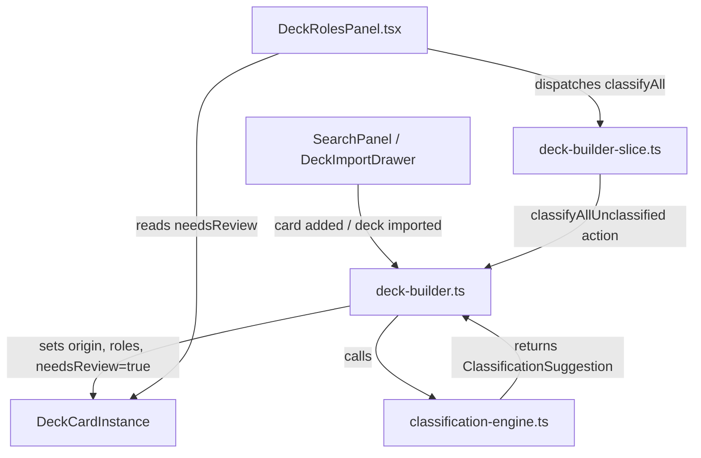

# Design Document: Auto Card Classification

## Overview

This feature adds a heuristic-based classification engine that automatically suggests an origin (`engine`, `non_engine`, `hybrid`) and roles (from the 16 existing `CardRole` types) for Yu-Gi-Oh! cards when they are added to a deck. The engine is a pure-function module (`classification-engine.ts`) that analyzes `ApiCardReference` properties — card type, frame type, effect text, archetype, attribute, level, ATK, DEF, race — and returns a `ClassificationSuggestion`. Integration points are: single card add, bulk "classify all" action, and deck import. Every auto-classified card gets `needsReview: true` so the user retains full control.

## Architecture



The classification engine is a leaf module with zero imports from Redux, React, or network layers. It receives an `ApiCardReference` and the built-in `RULE_SET`, and returns a `ClassificationSuggestion`. The deck-builder layer calls it at the three integration points and writes the result onto `DeckCardInstance`.

## Components and Interfaces

### New Module: `src/app/classification-engine.ts`

```typescript
import type { ApiCardReference, CardOrigin, CardRole } from '../types'

/** Output of the classification engine for a single card. */
export interface ClassificationSuggestion {
  origin: CardOrigin
  roles: CardRole[]
}

/** A single heuristic rule that inspects card data and may contribute roles. */
export interface HeuristicRule {
  id: string
  /** Returns roles this rule suggests for the given card, or empty array. */
  evaluate: (card: ApiCardReference) => CardRole[]
}

/** The ordered collection of all heuristic rules. Exported for isolated testing. */
export const RULE_SET: readonly HeuristicRule[]

/**
 * Pure function. Runs every rule in RULE_SET against the card,
 * collects suggested roles, then derives origin from the role set.
 */
export function classifyCard(card: ApiCardReference): ClassificationSuggestion

/**
 * Pure function. Given a set of suggested roles, derives the origin.
 * - Only interaction roles → non_engine
 * - Only game-plan roles → engine
 * - Both → hybrid
 * - tech → non_engine
 * - brick/garnet → engine
 * - No roles → non_engine (default)
 */
export function deriveOrigin(roles: CardRole[]): CardOrigin
```

### Role Category Constants

```typescript
/** Roles that advance the player's own game plan. */
const GAME_PLAN_ROLES: ReadonlySet<CardRole> = new Set([
  'starter', 'extender', 'enabler', 'searcher', 'draw',
  'combo_piece', 'payoff', 'recovery',
])

/** Roles that interact with the opponent. */
const INTERACTION_ROLES: ReadonlySet<CardRole> = new Set([
  'handtrap', 'disruption', 'boardbreaker', 'floodgate', 'removal',
])
```

### Heuristic Rules (RULE_SET order)

Each rule is a pure function `(card: ApiCardReference) => CardRole[]`. Rules are evaluated in this fixed order, and all matching roles are collected (a card can match multiple rules):

| # | Rule ID | Trigger condition | Suggested role(s) |
|---|---------|-------------------|--------------------|
| 1 | `handtrap` | Monster card + description matches hand-activation disruption patterns ("discard this card" + negate/destroy, or known hand trap archetypes) | `handtrap` |
| 2 | `draw` | Spell Card + description matches unconditional draw/filter patterns ("draw 1", "draw 2", "add cards from your Deck") | `draw` |
| 3 | `searcher` | Description matches search patterns ("add 1.*from your Deck to your hand", "add.*from your Deck") | `searcher` |
| 4 | `boardbreaker` | Description matches mass removal ("destroy all", "return all.*to the hand", "send all") | `boardbreaker` |
| 5 | `removal` | Description matches targeted removal ("destroy 1", "banish 1", "return 1.*to the hand") — only if boardbreaker didn't already match | `removal` |
| 6 | `recovery` | Description matches GY/banish recovery ("add.*from your GY", "Special Summon.*from your GY", "add.*that is banished") | `recovery` |
| 7 | `floodgate` | Continuous Spell/Trap or description with persistent restriction patterns ("cannot Special Summon", "cannot activate", "once per turn.*negate") | `floodgate` |
| 8 | `disruption` | Trap Card with reactive negation/destruction, or Quick-Play Spell with negation — only if floodgate didn't match | `disruption` |
| 9 | `payoff` | Extra Deck monster (fusion/synchro/xyz/link frameType) | `payoff` |
| 10 | `brick` | Monster with high level (≥7) and no other matched roles, or description contains "cannot be Normal Summoned" with no special summon clause | `brick` |

### Modified: `src/app/deck-builder.ts`

The `addSearchResultToZone` and `addSearchResultToDefaultZone` functions gain a call to `classifyCard` when creating a new `DeckCardInstance`:

```typescript
// Inside addSearchResultToZone, after creating the DeckCardInstance:
import { classifyCard } from './classification-engine'

const suggestion = classifyCard(cloneApiCardReference(searchResult))
// Apply suggestion:
// instance.origin = suggestion.origin
// instance.roles = [...suggestion.roles]
// instance.needsReview = true
```

A new exported function `classifyAllUnclassified` operates on a `DeckBuilderState`:

```typescript
export function classifyAllUnclassified(
  deckBuilder: DeckBuilderState,
): DeckBuilderState
```

This iterates all zones, finds cards with `origin === null && roles.length === 0`, runs `classifyCard` on each, and sets `needsReview: true`. Already-classified cards are left untouched.

### Modified: `src/app/deck-builder-slice.ts`

New reducer action:

```typescript
classifyAllUnclassifiedCards(state) {
  return classifyAllUnclassified(state)
}
```

### Modified: `src/app/deck-import.ts`

After building the imported `DeckBuilderState`, apply classification to cards that don't already have classification data. For JSON imports that carry existing `origin`/`roles`, those are preserved with `needsReview: false`. For text/YDK imports (which never carry classification), all cards get auto-classified with `needsReview: true`.

### Modified: `src/components/DeckRolesPanel.tsx`

1. Update `isCardPendingReview` in `role-step.ts` to return `card.needsReview === true` (currently hardcoded to `false`).
2. The existing "Revisión pendiente" filter and `countCardsPendingReview` already exist in the panel infrastructure — they just need the `isCardPendingReview` fix to start working.
3. Add a "Clasificar todo" button in the panel header that dispatches `classifyAllUnclassifiedCards`.

### Modified: `src/app/role-step.ts`

```typescript
// Change from:
export function isCardPendingReview(card: CardEntry): boolean {
  void card
  return false
}
// To:
export function isCardPendingReview(card: CardEntry): boolean {
  return card.needsReview === true
}
```

## Data Models

### ClassificationSuggestion

```typescript
interface ClassificationSuggestion {
  origin: CardOrigin    // 'engine' | 'non_engine' | 'hybrid'
  roles: CardRole[]     // subset of the 16 CardRole values, may be empty
}
```

### DeckCardInstance (existing, no schema changes)

The existing `DeckCardInstance` already has all needed fields:

```typescript
interface DeckCardInstance {
  instanceId: string
  name: string
  apiCard: ApiCardReference
  origin: CardOrigin | null   // set by classifyCard or user
  roles: CardRole[]           // set by classifyCard or user
  needsReview: boolean        // true = auto-classified, false = user-confirmed
}
```

No new fields are needed. The `needsReview` flag already exists but is currently always set to `false` on card add. The change is to set it to `true` when auto-classification is applied.

### ApiCardReference (existing, no changes)

The classification engine reads these fields from the existing `ApiCardReference`:
- `cardType`: "Effect Monster", "Spell Card", "Trap Card", etc.
- `frameType`: "effect", "spell", "trap", "fusion", "synchro", "xyz", "link", etc.
- `description`: Card effect text (nullable)
- `race`: Monster type like "Warrior", "Spellcaster" (nullable)
- `attribute`: "DARK", "LIGHT", etc. (nullable)
- `level`: Monster level 1-12 (nullable)
- `atk`, `def`: Combat stats as strings (nullable)
- `archetype`: Archetype name (nullable)

## Correctness Properties

*A property is a characteristic or behavior that should hold true across all valid executions of a system — essentially, a formal statement about what the system should do. Properties serve as the bridge between human-readable specifications and machine-verifiable correctness guarantees.*

### Property 1: Output Structure Invariant

*For any* valid `ApiCardReference`, calling `classifyCard` SHALL return a `ClassificationSuggestion` where `origin` is exactly one of `'engine'`, `'non_engine'`, or `'hybrid'`, and `roles` is an array (possibly empty) containing only valid `CardRole` values with no duplicates.

**Validates: Requirements 1.1, 1.3, 1.4**

### Property 2: Origin Derivation from Roles

*For any* valid `ApiCardReference`, the `origin` in the `ClassificationSuggestion` returned by `classifyCard` SHALL be consistent with the suggested `roles`:
- If all roles are interaction roles (handtrap, disruption, boardbreaker, floodgate, removal), origin is `non_engine`.
- If all roles are game-plan roles (starter, extender, enabler, searcher, draw, combo_piece, payoff, recovery), origin is `engine`.
- If roles contain both game-plan and interaction roles, origin is `hybrid`.
- If roles include `tech`, origin is `non_engine`.
- If roles include `brick` or `garnet` (and no interaction roles), origin is `engine`.
- If roles are empty, origin is `non_engine`.

**Validates: Requirements 3.1, 3.2, 3.3, 3.4, 3.5, 1.3**

### Property 3: Auto-Classification on Card Add

*For any* valid `ApiCardSearchResult` added to any deck zone, the resulting `DeckCardInstance` SHALL have a non-null `origin` and `needsReview` equal to `true`.

**Validates: Requirements 4.1, 4.2, 4.3**

### Property 4: Classify-All Fills Unclassified and Preserves Existing

*For any* `DeckBuilderState` containing a mix of classified and unclassified cards, after running `classifyAllUnclassified`:
- Every previously-unclassified card (origin=null, roles=[]) SHALL now have a non-null origin and `needsReview=true`.
- Every previously-classified card SHALL retain its original origin, roles, and needsReview values unchanged.

**Validates: Requirements 5.1, 5.2, 5.3, 5.4**

### Property 5: Import Auto-Classifies All Cards

*For any* deck imported via text or YDK format, every card in the resulting `DeckBuilderState` SHALL have a non-null `origin` and `needsReview` equal to `true`.

**Validates: Requirements 6.1, 6.2**

### Property 6: JSON Import Preserves Existing Classifications

*For any* JSON-imported deck where cards already have `origin` and `roles` set, those cards SHALL retain their existing classification with `needsReview` equal to `false`. Cards without existing classification SHALL be auto-classified with `needsReview` equal to `true`.

**Validates: Requirements 6.3**

### Property 7: User Override Clears needsReview

*For any* `DeckBuilderState` containing an auto-classified card (needsReview=true), when the user sets an origin or toggles a role on that card, the resulting `needsReview` SHALL be `false` for all copies of that card across all zones.

**Validates: Requirements 7.1, 7.2, 7.3**

### Property 8: Classification Suggestion Round-Trip

*For any* valid `ApiCardReference`, the `ClassificationSuggestion` produced by `classifyCard` SHALL survive a JSON serialization round-trip: `JSON.parse(JSON.stringify(suggestion))` produces a deeply equal suggestion.

**Validates: Requirements 9.2**

### Property 9: Classification Idempotence

*For any* valid `ApiCardReference`, calling `classifyCard` twice on the same input SHALL produce deeply equal `ClassificationSuggestion` outputs.

**Validates: Requirements 9.3, 1.2, 1.5**

## Error Handling

| Scenario | Handling |
|----------|----------|
| `ApiCardReference` with null `description` | Heuristic rules that inspect description skip the card (return no roles from that rule). Other rules (frameType-based, level-based) still apply. |
| `ApiCardReference` with null `cardType` or `frameType` | Should not happen per API contract, but if it does, the engine treats the card as unrecognizable and returns `{ origin: 'non_engine', roles: [] }`. |
| No heuristic rules match | Engine returns `{ origin: 'non_engine', roles: [] }` with `needsReview: true`. The user sees the card as unclassified and can manually tag it. |
| Classify-all on empty deck | No-op. Returns the same `DeckBuilderState` unchanged. |
| Import with malformed card data | Handled by existing import error handling. Classification only runs on successfully parsed cards. |

## Testing Strategy

### Property-Based Tests (fast-check)

The project already uses `fast-check` (v4.7.0) and `vitest` (v4.1.5). The existing test file `src/__tests__/remove-dead-modes.test.ts` provides arbitraries for `ApiCardReference` and `DeckCardInstance` that can be reused.

Each correctness property above maps to a single property-based test with minimum 100 iterations. Tests will be placed in `src/__tests__/classification-engine.test.ts`.

Tag format: `Feature: auto-card-classification, Property {N}: {title}`

**Property tests cover:**
- Properties 1–2: Classification engine output structure and origin derivation (pure function, no mocks needed)
- Property 3: Auto-classification on card add (tests `addSearchResultToZone` integration)
- Property 4: Classify-all behavior (tests `classifyAllUnclassified`)
- Properties 5–6: Import classification (tests import pipeline integration)
- Property 7: User override behavior (tests existing `setOriginForCard`/`toggleRoleForCard`)
- Properties 8–9: Round-trip and idempotence (pure function tests)

### Unit Tests (example-based)

Example-based tests for individual heuristic rules (Requirement 2) using concrete card descriptions:
- Known hand traps (Ash Blossom, Effect Veiler, Maxx "C" patterns)
- Known draw spells (Pot of Desires, Allure of Darkness patterns)
- Known searchers ("add 1" patterns)
- Known board breakers (Raigeki, Dark Hole patterns)
- Known floodgates (Skill Drain, Anti-Spell Fragrance patterns)
- Extra Deck monsters for payoff detection
- Edge cases: cards with null description, cards matching no rules

### Integration Tests

- Verify the full flow: add card → classification applied → user overrides → needsReview cleared
- Verify classify-all button dispatches correctly and updates state
- Verify import pipelines (text, YDK, JSON) apply classification appropriately
