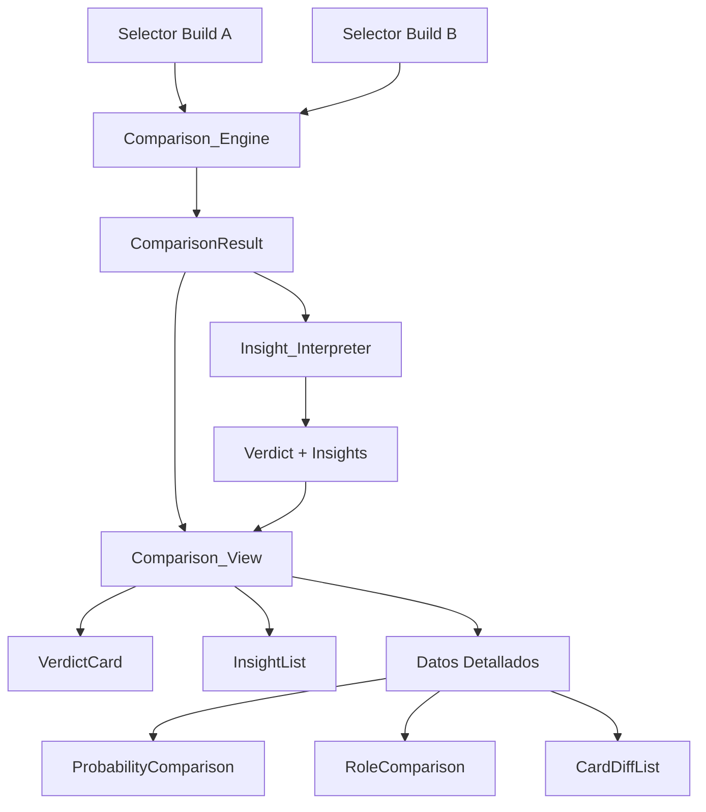

# Documento de Diseño — Build Comparison

## Resumen

Build Comparison extiende el sistema de snapshots existente con una capa de comparación inteligente que responde la pregunta "¿Este build es mejor?" en menos de 5 segundos. El diseño sigue una arquitectura de tres capas puras: un **Comparison_Engine** que calcula diffs estructurados entre dos `PortableConfig`, un **Insight_Interpreter** que transforma esos diffs en un Verdict y hasta 3 Insights priorizados, y una **Comparison_View** reactiva que presenta la información en orden jerárquico (conclusión → explicación → datos).

La lógica de negocio vive enteramente en funciones puras (sin estado, sin side-effects), lo que permite testing aislado con property-based tests. La UI se limita a renderizar el resultado sin lógica de decisión propia.

## Arquitectura

### Diagrama de flujo de datos



### Principios de diseño

1. **Funciones puras primero**: `Comparison_Engine` e `Insight_Interpreter` son funciones puras que reciben datos y retornan resultados. Sin acceso a Redux, sin side-effects.
2. **UI sin lógica de negocio**: Los componentes React solo renderizan. Toda decisión (qué es mejor, qué insight mostrar) viene resuelta desde las capas puras.
3. **Reutilización del motor existente**: Se usa `calculateProbabilities` + `buildCalculatorState` + `deriveMainDeckCardsFromZone` para calcular probabilidades de cada Build. No se reimplementa el motor.
4. **Jerarquía visual de decisión**: Verdict → Insights → Datos detallados. El usuario ve la conclusión primero.

### Capas del sistema

| Capa | Responsabilidad | Tipo |
|------|----------------|------|
| `Comparison_Engine` | Calcula diffs de cartas, roles y probabilidades entre dos `PortableConfig` | Función pura |
| `Insight_Interpreter` | Genera Verdict + Insights a partir del `ComparisonResult` | Función pura |
| `Comparison_View` | Renderiza el resultado con jerarquía visual | Componentes React |
| `Selectores de Build` | Permiten elegir workspace actual o snapshot como fuente | UI + Redux |


## Componentes e Interfaces

### Capa de Lógica Pura

#### `compareBuild(buildA: PortableConfig, buildB: PortableConfig): ComparisonResult`

Función principal del Comparison_Engine. Recibe dos `PortableConfig` y retorna un `ComparisonResult` estructurado.

Internamente:
1. Deriva `CardEntry[]` de cada build usando `deriveMainDeckCardsFromZone`.
2. Calcula `CalculationSummary` para cada build usando `buildCalculatorState` + `calculateProbabilities`.
3. Computa `CardDiff[]` comparando cartas del Main Deck por nombre (case-insensitive).
4. Computa `RoleDistribution` para cada build contando roles de las `CardEntry[]` derivadas.
5. Computa `PatternComparison[]` emparejando patrones por `getPatternDefinitionKey`.

#### `interpretComparison(result: ComparisonResult): ComparisonInterpretation`

Función principal del Insight_Interpreter. Recibe el `ComparisonResult` y retorna Verdict + Insights.

Internamente:
1. Genera Insights candidatos evaluando deltas de roles, probabilidades de openings y problems.
2. Filtra candidatos cuyo delta absoluto sea menor al `SIGNIFICANCE_THRESHOLD` (0.01 = 1pp).
3. Ordena por `InsightPriority` (critical > high > normal) y selecciona los top 3.
4. Aplica reglas de Verdict en orden: (a) delta de openings, (b) delta de bricks, (c) delta de problems.
5. Detecta trade-offs cuando los factores son contradictorios.
6. Genera `recommendation` basada en el tipo de Verdict y los factores dominantes.

### Componentes React

#### `ComparisonView`

Componente contenedor principal. Orquesta la selección de builds y renderiza el resultado.

```
Props:
  snapshots: WorkspaceSnapshot[]
  currentAppState: AppState
```

Estado interno:
- `sourceA: DeckSource` — workspace actual o snapshot ID
- `sourceB: DeckSource` — workspace actual o snapshot ID

Flujo:
1. Resuelve `PortableConfig` para cada source.
2. Llama `compareBuild(configA, configB)` dentro de `useMemo` con dependencias `[configA, configB]`.
3. Llama `interpretComparison(result)` dentro de un segundo `useMemo` con dependencia `[comparisonResult]`.
4. Renderiza `VerdictCard`, `InsightList`, y sección de datos detallados.

Optimización de performance:
- `compareBuild` y `interpretComparison` son funciones puras potencialmente costosas (recalculan probabilidades, diffs, roles). Se memorizan con `useMemo` para evitar recálculos innecesarios en cada render.
- `comparisonResult = useMemo(() => compareBuild(configA, configB), [configA, configB])` — solo se recalcula cuando cambia alguna de las dos configs seleccionadas.
- `interpretation = useMemo(() => interpretComparison(comparisonResult), [comparisonResult])` — solo se recalcula cuando cambia el resultado de la comparación.
- Esto garantiza que cambios de UI (expandir/colapsar secciones, hover, scroll) no disparen recálculos de la lógica pura.

#### `VerdictCard`

Muestra la conclusión principal: cuál build es mejor, el delta de probabilidad de openings, el delta de bricks y la recomendación contextual.

```
Props:
  verdict: Verdict
```

Diseño visual:
- Fondo con tono contextual (verde = mejora, rojo = empeora, neutro = equivalente).
- Texto principal: "Build A es mejor" / "Build B es mejor" / "Equivalentes".
- Subtexto: delta de openings formateado como porcentaje + delta de bricks como cantidad.
- Recomendación: texto contextual que indica cuándo elegir esta build (ej: "Recomendado si priorizás consistencia"). Se muestra debajo del subtexto solo cuando `recommendation` no es null.
- Si hay trade-off: indicador visual con ambos factores, incluyendo cuál build conviene, cuál es el costo y cuándo elegirla.

#### `InsightList`

Lista de hasta 3 Insights ordenados por prioridad.

```
Props:
  insights: Insight[]
```

Cada Insight muestra:
- Icono de prioridad (critical = ⚠️, high = 📊, normal = ℹ️).
- Texto descriptivo en formato causa → efecto (ver Copy Guidelines).
- Badge con el delta numérico.

#### `ProbabilityComparison`

Tabla side-by-side de probabilidades por patrón.

```
Props:
  patterns: PatternComparison[]
  totalOpeningsA: number
  totalOpeningsB: number
  totalProblemsA: number
  totalProblemsB: number
```

Muestra:
- Resumen de openings y problems totales con delta.
- Cada patrón con probabilidad A, probabilidad B, delta.
- Patrones exclusivos de una build marcados visualmente.

#### `RoleComparison`

Distribución de roles side-by-side.

```
Props:
  rolesA: RoleDistribution
  rolesB: RoleDistribution
```

Muestra cada categoría de rol con conteo A, conteo B y delta. Resalta deltas distintos de cero.

#### `CardDiffList`

Lista de cartas con diferencias en el Main Deck.

```
Props:
  diffs: CardDiff[]
  deckSizeA: number
  deckSizeB: number
```

Muestra:
- Cartas agregadas (verde), removidas (rojo), modificadas (amarillo).
- Delta de copias para cada carta.
- Conteo total de Main Deck para cada build.


## Copy Guidelines para Insights

### Principios de redacción

Los textos de Insights y Verdict siguen un estilo orientado al jugador, no al desarrollador. El objetivo es que cualquier jugador entienda el impacto de un cambio sin necesidad de interpretar datos técnicos.

### Reglas de formato

1. **Formato causa → efecto**: Cada Insight sigue la estructura `"cambio → consecuencia"`. El cambio es cuantitativo, la consecuencia es cualitativa.
2. **Frases cortas**: Máximo una oración. Sin subordinadas ni explicaciones largas.
3. **Lenguaje de jugador**: Usar términos que un jugador de Yu-Gi-Oh! reconoce (manos muertas, going second, combos, interrupción). Evitar jerga técnica de programación o estadística.
4. **Evitar lenguaje técnico**: No usar "delta", "threshold", "distribución", "probabilidad" en los textos visibles al usuario. Usar "consistencia", "riesgo", "capacidad".
5. **Cuantificar el cambio**: Incluir el número concreto del cambio al inicio (ej: "+2", "-3").

### Ejemplos de Insights por categoría

| Categoría | Ejemplo correcto | Ejemplo incorrecto |
|-----------|-----------------|-------------------|
| Starters ↑ | `"+2 starters → más manos jugables"` | `"La distribución de starters aumentó en 2 unidades"` |
| Starters ↓ | `"-1 starter → menos consistencia en apertura"` | `"Se redujo el conteo de starters"` |
| Bricks ↑ | `"+2 bricks → más riesgo de manos muertas"` | `"El delta de bricks es +2"` |
| Bricks ↓ | `"-2 bricks → menos manos muertas"` | `"Bricks decrementados en 2"` |
| Extenders ↑ | `"+2 extenders → más capacidad de seguir combos"` | `"Extenders increased by 2"` |
| Extenders ↓ | `"-1 extender → menos recuperación tras interrupción"` | `"Extender count reduced"` |
| Handtraps ↑ | `"+2 handtraps → más interacción going second"` | `"Handtrap distribution increased"` |
| Handtraps ↓ | `"-2 handtraps → menos interacción going second"` | `"Se modificó la cantidad de handtraps"` |
| Engine ↑ | `"+3 engine → motor más denso"` | `"Engine density increased by 3 cards"` |
| Engine ↓ | `"-2 engine → motor más liviano"` | `"Engine card count decreased"` |
| Openings ↑ | `"+3.2% consistencia de openings"` | `"Opening probability delta: +0.032"` |
| Openings ↓ | `"-2.1% consistencia de openings"` | `"Total opening probability decreased"` |
| Problems ↑ | `"+1.5% probabilidad de manos problemáticas"` | `"Problem pattern delta increased"` |
| Problems ↓ | `"-2.0% manos problemáticas"` | `"Problem probability reduced"` |

### Reglas de Verdict

El texto del `summary` del Verdict sigue las mismas reglas de copy: lenguaje de jugador, frases cortas, sin jerga técnica.

**Ejemplos de summary por tipo de Verdict:**

| Tipo | Ejemplo de summary |
|------|-------------------|
| `a_better` | `"Build A es más consistente"` |
| `b_better` | `"Build B reduce manos muertas"` |
| `equivalent` | `"Las diferencias son marginales"` |
| `tradeoff` | `"Build A mejora openings pero suma bricks"` |

### Reglas de Recommendation

El campo `recommendation` del Verdict provee una guía accionable para el jugador. Sigue el formato: `"Recomendado si..."` o `null` cuando no aplica.

**Reglas de generación:**

| Tipo de Verdict | Regla de recommendation |
|-----------------|------------------------|
| `a_better` (por openings) | `"Recomendado si priorizás consistencia"` |
| `a_better` (por bricks) | `"Recomendado si querés reducir manos muertas"` |
| `b_better` (por openings) | `"Recomendado si priorizás consistencia"` |
| `b_better` (por bricks) | `"Recomendado si querés reducir manos muertas"` |
| `equivalent` | `"Las diferencias son marginales; elegí por preferencia o match-up"` |
| `tradeoff` | Describe cuándo elegir cada lado. Ej: `"Elegí Build A si priorizás consistencia; Build B si querés menos bricks"` |

### Reglas de Trade-off

Cuando el Verdict es de tipo `tradeoff`, el sistema SIEMPRE debe responder tres preguntas:

1. **¿Cuál build conviene?** → Indicar cuál build gana en el factor de mayor prioridad.
2. **¿Cuál es el costo?** → Indicar qué se pierde al elegir esa build.
3. **¿Cuándo elegirla?** → Indicar en qué contexto o prioridad conviene esa elección.

**Ejemplo completo de trade-off:**
- `summary`: `"Build A mejora openings (+2.5%) pero suma +2 bricks"`
- `tradeoffDetail`: `"Build A gana consistencia de apertura a costa de más manos muertas"`
- `recommendation`: `"Elegí Build A si priorizás consistencia; Build B si querés menos bricks"`


## Modelos de Datos

### Tipos del Comparison_Engine

```typescript
/** Fuente de un deck para comparación */
type DeckSource =
  | { type: 'workspace' }
  | { type: 'snapshot'; snapshotId: string }

/** Diferencia de una carta entre dos builds */
interface CardDiff {
  cardName: string
  copiesA: number
  copiesB: number
  delta: number // copiesA - copiesB
  changeType: 'added' | 'removed' | 'modified'
}

/** Distribución de roles para una build */
type RoleDistribution = Record<CardRole, number>

/** Comparación de un patrón entre dos builds */
interface PatternComparison {
  patternName: string
  definitionKey: string
  kind: PatternKind
  probabilityA: number | null
  probabilityB: number | null
  delta: number | null
  exclusiveTo: 'A' | 'B' | null
}

/** Resultado completo del Comparison_Engine */
interface ComparisonResult {
  cardDiffs: CardDiff[]
  deckSizeA: number
  deckSizeB: number
  rolesA: RoleDistribution
  rolesB: RoleDistribution
  patternComparisons: PatternComparison[]
  totalOpeningProbabilityA: number
  totalOpeningProbabilityB: number
  totalProblemProbabilityA: number
  totalProblemProbabilityB: number
  openingDelta: number
  problemDelta: number
  buildsAreIdentical: boolean
}
```

### Tipos del Insight_Interpreter

```typescript
/** Nivel de prioridad de un Insight */
type InsightPriority = 'critical' | 'high' | 'normal'

/** Un Insight individual */
interface Insight {
  priority: InsightPriority
  text: string // Formato causa → efecto (ver Copy Guidelines)
  delta: number
  category: 'starters' | 'bricks' | 'extenders' | 'handtraps' | 'engine' | 'openings' | 'problems'
}

/** Tipo de Verdict */
type VerdictType = 'a_better' | 'b_better' | 'equivalent' | 'tradeoff'

/** Verdict generado por el Insight_Interpreter */
interface Verdict {
  type: VerdictType
  summary: string
  openingDeltaFormatted: string
  bricksDelta: number
  tradeoffDetail: string | null
  recommendation: string | null
}

/** Resultado completo del Insight_Interpreter */
interface ComparisonInterpretation {
  verdict: Verdict
  insights: Insight[] // máximo 3, ordenados por prioridad
}
```

### Constantes

```typescript
/** Umbral mínimo de diferencia significativa (1 punto porcentual) */
const SIGNIFICANCE_THRESHOLD = 0.01

/** Máximo de Insights a mostrar */
const MAX_INSIGHTS = 3
```

### Relación con tipos existentes

| Tipo existente | Uso en Build Comparison |
|---|---|
| `PortableConfig` | Input del Comparison_Engine (representa una Build completa) |
| `WorkspaceSnapshot` | Fuente de builds guardadas, contiene `config: PortableConfig` |
| `AppState` | Se convierte a `PortableConfig` via `toPortableConfig()` para el workspace actual |
| `CardEntry` | Se deriva de `PortableConfig.deckBuilder.main` via `deriveMainDeckCardsFromZone` |
| `CardRole` | Claves de `RoleDistribution` |
| `PatternKind` | Clasificación de patrones en `PatternComparison` |
| `CalculationSummary` | Resultado intermedio del motor de probabilidad, se usa para extraer probabilidades por patrón |
| `HandPattern` | Se reconstruye desde `PortablePattern[]` del `PortableConfig` para calcular probabilidades |


## Propiedades de Correctitud

*Una propiedad es una característica o comportamiento que debe cumplirse en todas las ejecuciones válidas de un sistema — esencialmente, una declaración formal sobre lo que el sistema debe hacer. Las propiedades sirven como puente entre especificaciones legibles por humanos y garantías de correctitud verificables por máquina.*

### Property 1: Máximo 3 Insights

*Para cualquier* `ComparisonResult` válido, la función `interpretComparison` SHALL retornar una lista de Insights con longitud menor o igual a 3.

**Validates: Requirements 2.3, 3.1, 3.12**

### Property 2: Insights ordenados por prioridad

*Para cualquier* `ComparisonResult` válido, los Insights retornados por `interpretComparison` SHALL estar ordenados por `InsightPriority` de mayor a menor (critical antes que high, high antes que normal). Es decir, para todo par consecutivo de insights `(insights[i], insights[i+1])`, la prioridad de `insights[i]` debe ser mayor o igual a la de `insights[i+1]`.

**Validates: Requirements 3.2**

### Property 3: Filtrado por umbral de significancia

*Para cualquier* `ComparisonResult` donde todos los deltas de roles y probabilidades tienen valor absoluto menor al `SIGNIFICANCE_THRESHOLD` (0.01), la función `interpretComparison` SHALL retornar una lista vacía de Insights.

**Validates: Requirements 3.13**

### Property 4: Insights críticos para cambios de starters y bricks

*Para cualquier* `ComparisonResult` donde el delta de cartas con rol "starter" supera el `SIGNIFICANCE_THRESHOLD` en valor absoluto, O donde el conteo de cartas con rol "brick" o "garnet" cambia, la función `interpretComparison` SHALL incluir al menos un Insight con prioridad `critical` relacionado con ese cambio.

**Validates: Requirements 3.3, 3.4, 3.5, 3.6**

### Property 5: Insights de prioridad correcta según tipo de rol

*Para cualquier* `ComparisonResult` donde el delta de cartas con rol "extender" o "handtrap" supera el `SIGNIFICANCE_THRESHOLD` en valor absoluto, la función `interpretComparison` SHALL incluir al menos un Insight con prioridad `high` relacionado con ese cambio. Para cambios de origin "engine" que superan el threshold, SHALL incluir un Insight con prioridad `normal`.

**Validates: Requirements 3.7, 3.8, 3.9**

### Property 6: Cadena de prioridad del Verdict

*Para cualquier* `ComparisonResult`:
- Si el delta de openings supera el threshold, el Verdict SHALL favorecer la Build con mayor probabilidad de openings.
- Si el delta de openings está bajo el threshold pero el delta de bricks es distinto de cero, el Verdict SHALL favorecer la Build con menos bricks.
- Si ambos están bajo el threshold pero el delta de problems supera el threshold, el Verdict SHALL favorecer la Build con menor probabilidad de problems.
- Si todos los deltas están bajo el threshold, el Verdict SHALL ser de tipo `equivalent`.

**Validates: Requirements 4.1, 4.2, 4.3, 4.4, 4.5, 2.5**

### Property 7: Detección de trade-offs en el Verdict

*Para cualquier* `ComparisonResult` donde una Build mejora en openings (delta positivo sobre threshold) pero empeora en bricks (aumento de bricks), la función `interpretComparison` SHALL generar un Verdict de tipo `tradeoff` que incluya `tradeoffDetail` no nulo. Además, el `tradeoffDetail` SHALL indicar cuál build conviene, cuál es el costo y cuándo elegirla.

**Validates: Requirements 4.6**

### Property 8: Formato del Verdict incluye deltas y recommendation

*Para cualquier* `ComparisonResult` válido, el Verdict retornado por `interpretComparison` SHALL incluir:
- `openingDeltaFormatted` como string de porcentaje.
- `bricksDelta` como número entero que refleja la diferencia de bricks entre builds.
- `recommendation` como string no nulo cuando el tipo de Verdict es `a_better`, `b_better` o `tradeoff`, y como string no nulo (con mensaje de equivalencia) cuando el tipo es `equivalent`.

**Validates: Requirements 4.7, 4.8**

### Property 9: Correctitud del Card_Diff

*Para cualquier* par de `PortableConfig` válidos, la función `compareBuild` SHALL producir `CardDiff[]` donde: cada carta con `copiesA > 0` y `copiesB === 0` tiene `changeType === 'added'`, cada carta con `copiesA === 0` y `copiesB > 0` tiene `changeType === 'removed'`, y cada carta con ambos `> 0` y distintos tiene `changeType === 'modified'`. Además, `delta === copiesA - copiesB` para toda carta.

**Validates: Requirements 5.1, 5.2**

### Property 10: Role_Distribution con soporte multi-rol

*Para cualquier* `PortableConfig` válido, la `RoleDistribution` calculada por `compareBuild` SHALL contabilizar cada rol de cada carta de forma independiente. Es decir, si una carta tiene roles `['starter', 'searcher']` con 3 copias, tanto `starter` como `searcher` deben incrementarse en 3.

**Validates: Requirements 6.1, 6.4**

### Property 11: Clasificación de exclusividad de patrones

*Para cualquier* par de `PortableConfig` válidos, la función `compareBuild` SHALL clasificar cada `PatternComparison` con `exclusiveTo === 'A'` si el patrón solo existe en Build A, `exclusiveTo === 'B'` si solo existe en Build B, y `exclusiveTo === null` si existe en ambas.

**Validates: Requirements 7.1, 7.2**

### Property 12: Independencia del orden de cartas

*Para cualquier* par de `PortableConfig` válidos, si se permutan las cartas del Main Deck de cualquiera de las builds, la función `compareBuild` SHALL producir `CardDiff[]` idéntico al resultado sin permutación.

**Validates: Requirements 8.2**

### Property 13: Comparación identidad

*Para cualquier* `PortableConfig` válido, comparar una Build contra sí misma SHALL retornar `buildsAreIdentical === true`, `cardDiffs` vacío, todos los deltas de roles en cero, y todos los `PatternComparison` con `delta === 0`.

**Validates: Requirements 8.3**

### Property 14: Simetría de la comparación

*Para cualquier* par de `PortableConfig` válidos (A, B), si `compareBuild(A, B)` produce un `CardDiff` con `delta = d` para una carta, entonces `compareBuild(B, A)` SHALL producir un `CardDiff` con `delta = -d` para la misma carta. Las cartas `added` en una dirección SHALL ser `removed` en la otra.

**Validates: Requirements 8.4**


## Manejo de Errores

### Comparison_Engine

| Escenario | Comportamiento |
|-----------|---------------|
| Build con Main Deck vacío | Retorna `ComparisonResult` con `deckSizeA/B = 0`, `cardDiffs` vacío, roles en cero. No lanza error. |
| Build sin patrones | `patternComparisons` vacío, probabilidades totales en 0. No lanza error. |
| Build con cartas sin clasificar (origin/roles null) | Calcula con los datos disponibles. Cartas sin roles no contribuyen a `RoleDistribution`. |
| Snapshot corrupto o con `PortableConfig` inválido | Se captura en la capa de UI al intentar parsear. Se muestra mensaje de error al usuario sin crashear. |
| Motor de probabilidad retorna `summary: null` (blocking issues) | Se trata como probabilidad 0 para esa build. Se incluye nota en el resultado. |

### Insight_Interpreter

| Escenario | Comportamiento |
|-----------|---------------|
| `ComparisonResult` con todos los deltas en cero | Retorna Verdict `equivalent` con `recommendation: "Las diferencias son marginales; elegí por preferencia o match-up"` e Insights vacíos. |
| `ComparisonResult` con probabilidades null (builds sin clasificar) | Omite insights de probabilidad. Verdict se basa solo en roles y card diffs disponibles. `recommendation` se genera según los factores disponibles. |
| Más de 3 insights candidatos | Selecciona los 3 de mayor prioridad, descarta el resto. |
| Trade-off detectado | Genera Verdict con `tradeoffDetail` no nulo y `recommendation` que indica cuándo elegir cada build. |

### UI

| Escenario | Comportamiento |
|-----------|---------------|
| Sin snapshots guardados | Muestra mensaje indicando que se necesita al menos un snapshot. |
| Mismo source seleccionado para ambos lados | Muestra aviso de builds idénticas. Aún permite ver el resultado (todo en cero). |
| Error al cargar snapshot de localStorage | Muestra mensaje de error. No modifica el workspace. |

## Estrategia de Testing

### Testing dual: Unit Tests + Property-Based Tests

Esta feature se beneficia especialmente de property-based testing porque el `Comparison_Engine` y el `Insight_Interpreter` son funciones puras con espacios de entrada grandes (cualquier par de builds válidas).

### Property-Based Tests

**Librería**: [fast-check](https://github.com/dubzzz/fast-check) (ya compatible con el stack TypeScript/Vitest del proyecto).

**Configuración**: Mínimo 100 iteraciones por propiedad.

**Tag format**: `Feature: build-comparison, Property {number}: {property_text}`

**Generadores necesarios**:

1. **`arbitraryPortableConfig`**: Genera `PortableConfig` válidos con:
   - Main Deck de 1-60 cartas con roles y origins aleatorios.
   - 0-15 patrones con condiciones válidas.
   - `handSize` entre 1 y 7.

2. **`arbitraryComparisonResult`**: Genera `ComparisonResult` válidos con:
   - `cardDiffs` consistentes (delta = copiesA - copiesB, changeType correcto).
   - `RoleDistribution` con valores no negativos.
   - Probabilidades entre 0 y 1.
   - Deltas calculados correctamente.

3. **`arbitraryPortableConfigPair`**: Genera pares de configs que comparten algunos patrones y cartas para testear exclusividad y diffs realistas.

**Propiedades a implementar** (14 tests, uno por propiedad del documento):

| Propiedad | Generador principal | Qué verifica |
|-----------|-------------------|-------------|
| 1. Max 3 Insights | `arbitraryComparisonResult` | `insights.length <= 3` |
| 2. Orden de prioridad | `arbitraryComparisonResult` | Insights ordenados critical > high > normal |
| 3. Filtrado por threshold | `arbitraryComparisonResult` (deltas < 0.01) | `insights.length === 0` |
| 4. Critical para starters/bricks | `arbitraryComparisonResult` (con deltas grandes) | Insight critical presente |
| 5. Prioridad por tipo de rol | `arbitraryComparisonResult` (con deltas de extenders/handtraps) | Prioridad correcta |
| 6. Cadena de prioridad del Verdict | `arbitraryComparisonResult` | Verdict sigue la cadena |
| 7. Trade-off | `arbitraryComparisonResult` (openings mejoran, bricks aumentan) | `verdict.type === 'tradeoff'` y `tradeoffDetail` no nulo |
| 8. Formato del Verdict | `arbitraryComparisonResult` | Campos formateados presentes, incluyendo `recommendation` no nulo |
| 9. Correctitud Card_Diff | `arbitraryPortableConfigPair` | changeType y delta correctos |
| 10. Role_Distribution multi-rol | `arbitraryPortableConfig` | Conteo independiente por rol |
| 11. Exclusividad de patrones | `arbitraryPortableConfigPair` | `exclusiveTo` correcto |
| 12. Independencia de orden | `arbitraryPortableConfigPair` | Shuffle no cambia resultado |
| 13. Identidad | `arbitraryPortableConfig` | Comparar contra sí mismo = sin diffs |
| 14. Simetría | `arbitraryPortableConfigPair` | `delta(A,B) = -delta(B,A)` |

### Unit Tests (ejemplo-based)

Cubren escenarios específicos y edge cases que complementan las propiedades:

1. **Comparison_Engine**:
   - Dos builds vacías → resultado vacío.
   - Build con una carta agregada → un CardDiff `added`.
   - Build con carta removida → un CardDiff `removed`.
   - Build con carta modificada (2→3 copias) → CardDiff `modified` con delta +1.

2. **Insight_Interpreter**:
   - Resultado con +3 starters → insight critical con texto en formato causa → efecto.
   - Resultado con -2 handtraps → insight high con texto en formato causa → efecto.
   - Resultado con trade-off (mejora openings, más bricks) → verdict tradeoff con `tradeoffDetail` indicando conveniencia/costo/cuándo, y `recommendation` no nulo.
   - Resultado con diferencias marginales (< 1pp) → verdict equivalent, sin insights, `recommendation` con mensaje de equivalencia.
   - Verdict `a_better` por openings → `recommendation` = `"Recomendado si priorizás consistencia"`.
   - Verdict `a_better` por bricks → `recommendation` = `"Recomendado si querés reducir manos muertas"`.
   - Textos de insights siguen Copy Guidelines (causa → efecto, frases cortas, lenguaje de jugador).

3. **UI Components** (ejemplo-based con React Testing Library):
   - VerdictCard renderiza correctamente para cada tipo de verdict, incluyendo `recommendation` cuando no es null.
   - VerdictCard no muestra sección de recommendation cuando es null.
   - InsightList muestra máximo 3 items con textos en formato causa → efecto.
   - CardDiffList aplica colores correctos por changeType.
   - ComparisonView muestra aviso cuando ambos sources son iguales.
   - ComparisonView muestra mensaje cuando no hay snapshots.

### Cobertura por requerimiento

| Req | Property Tests | Unit Tests |
|-----|---------------|------------|
| R1 (Selección) | — | UI examples |
| R2 (Estructura UI) | P1, P6 | UI layout examples |
| R3 (Insights) | P1-P5 | Insight text examples, Copy Guidelines compliance |
| R4 (Verdict) | P6-P8 | Verdict text examples, recommendation examples, trade-off completeness |
| R5 (Card Diff) | P9, P12 | Specific diff examples |
| R6 (Roles) | P10 | Role count examples |
| R7 (Probabilidades) | P11 | Pattern comparison examples |
| R8 (Función pura) | P12-P14 | Purity verification |
| R9 (Navegación) | — | UI navigation examples |
