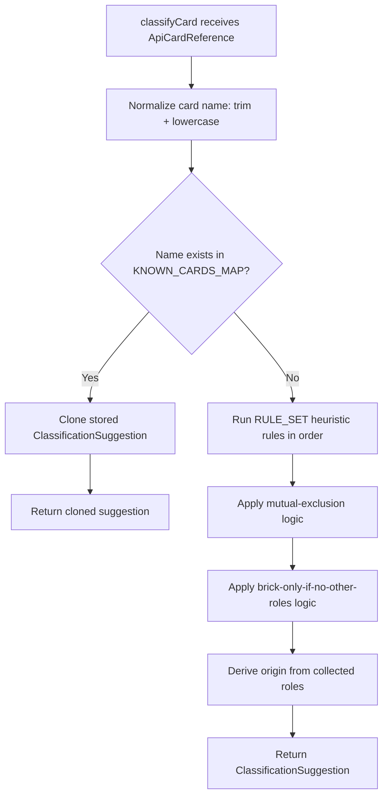

# Design Document: Classification Engine Improvements

## Overview

This design improves the classification engine at `src/app/classification-engine.ts` with two targeted changes:

1. A **KNOWN_CARDS_MAP** — a static `Map<string, ClassificationSuggestion>` of 50+ competitively relevant Yu-Gi-Oh! cards with pre-assigned origins and roles. The map is checked before heuristic rules run, giving instant accurate classification for staple cards that appear across virtually every tournament deck.

2. **Refined regex patterns** for all 10 existing heuristic rules (`handtrap`, `draw`, `searcher`, `boardbreaker`, `removal`, `recovery`, `floodgate`, `disruption`, `payoff`, `brick`) to improve detection accuracy, reduce false positives/negatives, and handle edge cases the current patterns miss.

Both changes are confined to a single file and preserve the engine's pure-function architecture with zero external dependencies.

## Architecture

The classification engine's control flow gains one new decision point at the top:



Key architectural decisions:

- **Map-first, rules-second**: The KNOWN_CARDS_MAP lookup is O(1) and short-circuits the entire RULE_SET evaluation. This is the simplest possible priority mechanism — no configuration, no flags, no merge logic.
- **Clone on read**: The map stores canonical entries. `classifyCard` returns a shallow clone (`{ ...entry, roles: [...entry.roles] }`) so callers cannot mutate the map's data.
- **Single file**: All changes stay in `classification-engine.ts`. No new modules, no new imports.

## Components and Interfaces

### Existing Interfaces (unchanged)

```typescript
export interface ClassificationSuggestion {
  origin: CardOrigin
  roles: CardRole[]
}

export interface HeuristicRule {
  id: string
  evaluate: (card: ApiCardReference) => CardRole[]
}
```

### New Exports

```typescript
/** Static map of known card names → pre-assigned classifications. */
export const KNOWN_CARDS_MAP: ReadonlyMap<string, ClassificationSuggestion>
```

### Modified Function

```typescript
/**
 * Pure function. Checks KNOWN_CARDS_MAP first; if not found, runs RULE_SET.
 * Always returns a new object (never a reference to stored data).
 */
export function classifyCard(card: ApiCardReference): ClassificationSuggestion
```

### Internal Helper

```typescript
/** Normalize a card name for map lookup: trim whitespace, lowercase. */
function normalizeCardName(name: string): string {
  return name.trim().toLowerCase()
}
```

Note: `deck-builder.ts` already has a local `normalizeCardName` with the same logic (`toLocaleLowerCase`). The classification engine will use its own copy to maintain zero cross-module coupling. Both use trim + lowercase which produces identical results for card names (ASCII + basic Unicode).

### Regex Pattern Changes

All 10 rules get updated regex patterns. The rule interface and evaluation order remain the same. Changes are purely in the regex constants and the conditional logic within each rule's `evaluate` function.

| Rule | Current Gap | Improvement |
|------|------------|-------------|
| handtrap | Only catches "discard this card" pattern | Adds "send from hand to GY", "banish from hand", "reveal in hand", "if your opponent" trigger + Special Summon, trap hand-activation |
| draw | Only spell cards, basic "draw N cards" | Adds "excavate the top" / "reveal the top" + "add to hand", monster draw effects |
| searcher | Basic "add from deck to hand" | Adds "add 1" / "add up to" patterns, "excavate" / "look at the top" + add, "Special Summon from Deck" recruitment |
| boardbreaker | "destroy all / return all / send all" | Adds "banish all" / "shuffle all" + opponent-targeting, negate-all effects |
| removal | Basic targeted destroy/banish | Adds opponent-tribute mechanics (Kaiju-style), single-target negate |
| recovery | GY add/summon | No major gap — minor pattern refinement |
| floodgate | Continuous spell/trap only | Adds monster floodgates ("while face-up" + "cannot"), field spells, "each player can only" / "neither player can" |
| disruption | Trap negate, Quick-Play negate | Adds counter trap auto-tag, "negate the Summon" + destroy |
| payoff | Extra deck monster = payoff | No change needed |
| brick | Cannot normal summon, level ≥ 7 | No major gap — minor refinement |

## Data Models

### KNOWN_CARDS_MAP Structure

```typescript
const KNOWN_CARDS_MAP_ENTRIES: Array<[string, ClassificationSuggestion]> = [
  // Hand traps
  ['ash blossom & joyous spring', { origin: 'non_engine', roles: ['handtrap'] }],
  ['maxx "c"', { origin: 'non_engine', roles: ['handtrap', 'draw'] }],
  ['effect veiler', { origin: 'non_engine', roles: ['handtrap'] }],
  // ... 50+ entries total
]

export const KNOWN_CARDS_MAP: ReadonlyMap<string, ClassificationSuggestion> =
  new Map(KNOWN_CARDS_MAP_ENTRIES)
```

Map keys are normalized card names (trimmed, lowercased). Values are `ClassificationSuggestion` objects with:
- Exactly one `CardOrigin` value
- One or more `CardRole` values, no duplicates

The map covers these categories:
- **Hand traps** (~13 cards): Ash Blossom, Maxx "C", Effect Veiler, Ghost Ogre, Ghost Belle, Droll & Lock Bird, D.D. Crow, Nibiru, PSY-Framegear Gamma, Infinite Impermanence, Ghost Mourner, Dimension Shifter, Skull Meister
- **Staple spells** (~17 cards): Called by the Grave, Crossout Designator, Triple Tactics Talent, Forbidden Droplet, Dark Ruler No More, Harpie's Feather Duster, Raigeki, Lightning Storm, Pot of Prosperity, Pot of Desires, Pot of Extravagance, Allure of Darkness, Upstart Goblin, Foolish Burial, Monster Reborn, One for One, Book of Moon
- **Staple traps** (~11 cards): Solemn Judgment, Solemn Strike, Torrential Tribute, Compulsory Evacuation Device, Dimensional Barrier, Anti-Spell Fragrance, Skill Drain, Rivalry of Warlords, Gozen Match, There Can Be Only One, Infinite Impermanence (also in hand traps)
- **Board breakers & tech** (~10+ cards): Evenly Matched, Lava Golem, Gameciel, Gadarla, Dogoran, Kumongous, Super Polymerization, Forbidden Chalice

### ClassificationSuggestion (unchanged)

```typescript
{
  origin: CardOrigin    // 'engine' | 'non_engine' | 'hybrid'
  roles: CardRole[]     // one or more from the 16 CardRole values
}
```

No new types are introduced. The only new data structure is the map itself.


## Correctness Properties

*A property is a characteristic or behavior that should hold true across all valid executions of a system — essentially, a formal statement about what the system should do. Properties serve as the bridge between human-readable specifications and machine-verifiable correctness guarantees.*

### Property 1: Map entry invariants

*For all* entries in the KNOWN_CARDS_MAP, the key SHALL equal `key.trim().toLowerCase()`, the origin SHALL be a valid `CardOrigin` value, the roles array SHALL be non-empty, and the roles array SHALL contain no duplicate values.

**Validates: Requirements 1.4, 1.5**

### Property 2: Known card lookup correctness

*For any* card name that exists in the KNOWN_CARDS_MAP, calling `classifyCard` with an `ApiCardReference` whose name is a case-varied and whitespace-padded version of that name SHALL return a `ClassificationSuggestion` that is deeply equal to the entry stored in the map, regardless of the card's `description`, `cardType`, `frameType`, or other fields.

**Validates: Requirements 2.1, 2.3, 2.4**

### Property 3: Clone isolation

*For any* card name that exists in the KNOWN_CARDS_MAP, the `ClassificationSuggestion` object returned by `classifyCard` SHALL NOT be the same reference as the object stored in the map, and the returned `roles` array SHALL NOT be the same reference as the stored `roles` array.

**Validates: Requirements 10.6**

### Property 4: Idempotence

*For any* valid `ApiCardReference`, calling `classifyCard` twice with the same input SHALL produce deeply equal `ClassificationSuggestion` outputs.

**Validates: Requirements 10.3**

### Property 5: JSON serialization round-trip

*For any* valid `ApiCardReference`, the `ClassificationSuggestion` produced by `classifyCard` SHALL survive a `JSON.parse(JSON.stringify(...))` round-trip and produce a deeply equal result.

**Validates: Requirements 10.4**

### Property 6: Hand trap detection

*For any* monster card whose description contains a Quick Effect clause combined with hand-activation language (send from hand to GY, banish from hand, reveal in hand), or "during either player's turn" / "during opponent's Main Phase" combined with a disruptive effect, or "if your opponent" trigger combined with Special Summon from hand, the classification engine SHALL include `handtrap` in the suggested roles. *For any* trap card whose description contains hand-activation language, the engine SHALL evaluate the card for the `handtrap` role.

**Validates: Requirements 4.1, 4.2, 4.3, 4.4**

### Property 7: Searcher detection

*For any* card whose description matches "add 1" or "add up to" followed by "from your Deck to your hand", or "excavate" / "look at the top" combined with "add" and "to your hand", or "Special Summon 1" / "Special Summon from your Deck" (deck-to-field recruitment), the classification engine SHALL include `searcher` in the suggested roles.

**Validates: Requirements 5.1, 5.2, 5.3**

### Property 8: Draw detection

*For any* spell card whose description matches "draw" followed by a number and "card", or "excavate the top" / "reveal the top" combined with "add" and "to your hand", the classification engine SHALL include `draw` in the suggested roles. *For any* monster card whose description contains "draw 1 card" or "draw 2 cards", the engine SHALL also include `draw` in the suggested roles.

**Validates: Requirements 6.1, 6.2, 6.3**

### Property 9: Board breaker and removal detection

*For any* card whose description matches "banish all" / "shuffle all" / "return all cards" combined with opponent-targeting language, the engine SHALL include `boardbreaker` in the suggested roles. *For any* card whose description matches "Tribute 1 monster your opponent controls" or similar opponent-tribute mechanics, the engine SHALL include `removal` in the suggested roles.

**Validates: Requirements 7.1, 7.2, 7.3**

### Property 10: Disruption detection

*For any* Quick-Play spell card whose description contains negation language ("negate the effects" or "negate the activation"), the engine SHALL include `disruption` in the suggested roles. *For any* counter trap card, the engine SHALL include `disruption`. *For any* trap card whose description contains "negate the Summon" or "negate the activation" combined with destruction, the engine SHALL include `disruption`.

**Validates: Requirements 8.1, 8.2, 8.3**

### Property 11: Floodgate detection

*For any* continuous spell, continuous trap, or field spell whose description contains persistent restriction language ("cannot Special Summon", "cannot activate", "cannot add cards"), the engine SHALL include `floodgate` in the suggested roles. *For any* monster card whose description contains "while this card is face-up" combined with "cannot", the engine SHALL evaluate for `floodgate`. *For any* card whose description contains "each player can only" or "neither player can", the engine SHALL include `floodgate`.

**Validates: Requirements 9.1, 9.2, 9.3**

## Error Handling

The classification engine is a pure function with no I/O, so error handling is minimal:

- **Null/missing description**: All regex rules already guard against `null` descriptions (`if (!desc) return []`). No change needed.
- **Null/missing card name**: If `card.description` is used for name lookup and the name field comes from `ApiCardReference` — the card name comes from the caller (e.g., `searchResult.name` in `deck-builder.ts`). The `classifyCard` function receives `ApiCardReference` which does not have a `name` field. The lookup will use the card's identifying information. Since `ApiCardReference` doesn't have a `name` field, the known-cards lookup needs the name passed separately or we need to check how `classifyCard` is called.

**Design Decision**: Looking at the call sites in `deck-builder.ts`, `classifyCard` receives an `ApiCardReference` which does NOT have a `name` field. The card name is available on `searchResult.name` (from `ApiCardSearchResult`) or `card.name` (from `DeckCardInstance`). 

Two options:
1. Change `classifyCard` signature to accept `(card: ApiCardReference, name?: string)` 
2. Change `classifyCard` signature to accept `(card: ApiCardReference & { name?: string })`

**Chosen approach**: Option 1 — add an optional `name` parameter. This is backward-compatible: existing callers that don't pass a name get pure heuristic behavior (no regression). Callers that pass a name get the map lookup first. The call sites in `deck-builder.ts` already have the name available (`searchResult.name`) and can pass it.

Updated signature:
```typescript
export function classifyCard(card: ApiCardReference, name?: string): ClassificationSuggestion
```

If `name` is undefined or empty, the map lookup is skipped and the engine falls through to RULE_SET. This means:
- No runtime errors from missing names
- Backward compatibility with any caller that doesn't pass a name
- The map is only consulted when the caller provides a name

## Testing Strategy

### Test Framework

- **Vitest** for test runner (already configured in the project)
- **fast-check** for property-based testing (already a devDependency)

### Property-Based Tests

Each correctness property (Properties 1–11) will be implemented as a property-based test using fast-check with a minimum of 100 iterations per property. Each test will be tagged with a comment referencing the design property:

Tag format: `Feature: classification-engine-improvements, Property {number}: {title}`

**Generators needed:**
- `arbApiCardReference` — already exists in `src/__tests__/remove-dead-modes.test.ts`, can be reused/imported
- `arbKnownCardName` — `fc.constantFrom(...KNOWN_CARDS_MAP.keys())` to pick random known card names
- `arbCaseVariation(name)` — applies random case changes and whitespace padding to a card name
- `arbHandtrapDescription` — generates monster card descriptions containing hand trap activation patterns
- `arbSearcherDescription` — generates descriptions containing searcher patterns
- `arbDrawDescription` — generates descriptions containing draw patterns
- `arbBoardbreakerDescription` — generates descriptions containing boardbreaker patterns
- `arbRemovalDescription` — generates descriptions containing removal patterns (Kaiju-style)
- `arbDisruptionDescription` — generates descriptions containing disruption patterns
- `arbFloodgateDescription` — generates descriptions containing floodgate patterns

### Unit Tests (Example-Based)

- **Requirement 3 coverage tests**: Verify specific named cards exist in the map with correct roles (3.1–3.5)
- **Multi-role cards**: Verify cards like Infinite Impermanence have all applicable roles
- **Map size**: Verify `KNOWN_CARDS_MAP.size >= 50`
- **Category coverage**: Verify at least one entry per required category

### Test File Location

`src/__tests__/classification-engine.test.ts`
