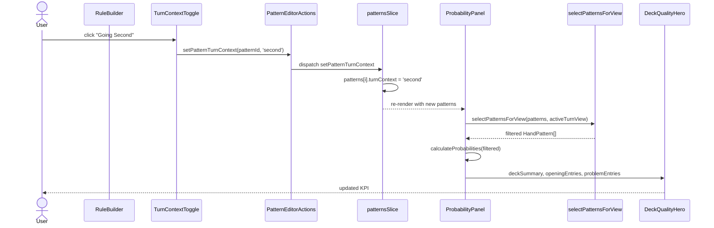
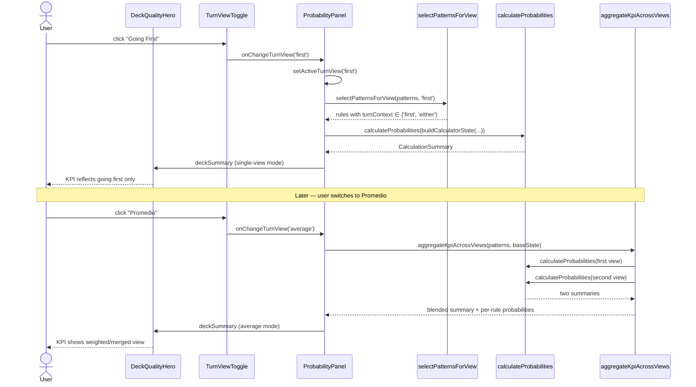
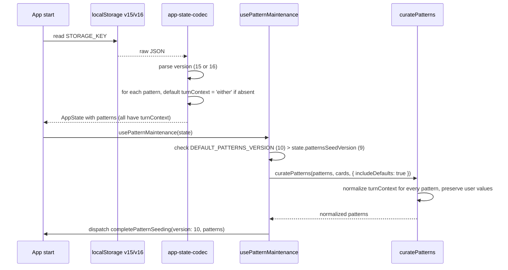

# Design Document: Turn-Context Aware Rules

## Overview

The Probability Lab currently evaluates every `HandPattern` with a single binary label (`opening` or `problem`), independent of who goes first. That collapses two genuinely different hand qualities into one number: "2x Mulcharmy" is a strong opening going second but a dead brick going first, yet today it would be forced to be modelled as a global opening, a global problem, or not at all.

This feature adds turn-context awareness to rules and to the KPI Hero. Each `HandPattern` gains an optional `turnContext` property with three states (`'first' | 'second' | 'either'`, default `'either'`). The Probability Lab gets a global `activeTurnView` selector (`'first' | 'second' | 'average'`, default `'average'`) that controls which rules contribute to the main KPI and which appear in the opening/problem cards. The underlying combinatorial engine is untouched; filtering happens at the pipeline layer that builds what gets passed to `calculateProbabilities`.

Backward compatibility is the dominant constraint. Every existing pattern — user-created, auto-seeded, quick-added, or hydrated from localStorage / URL share link / workspace snapshot / portable config version 15 — must continue to behave identically under the default `'average'` view. That means both the migration path and the KPI math for `'average'` must reduce to the current behavior when every rule is `'either'`.

## Architecture

The feature adds a narrow cross-cutting concern: one new field on the pattern model, one new piece of UI state, and one filter step in the calculation pipeline. No new Redux slice, no new storage key, no new persistence format version (bump existing version 15 → 16).

```mermaid
graph TD
    subgraph "State Layer"
        A[patterns-slice<br/>HandPattern[]]
        B[ProbabilityPanel<br/>useState: activeTurnView]
    end

    subgraph "UI Layer"
        C[RuleBuilder<br/>TurnContextToggle]
        D[DeckQualityHero<br/>TurnViewToggle]
    end

    subgraph "Pipeline Layer"
        E[selectPatternsForView]
        F[buildDeterministicCheckSet]
        G[buildCalculatorState]
    end

    subgraph "Calculation Layer - unchanged"
        H[calculateProbabilities]
        I[buildCalculationSummary]
    end

    subgraph "Aggregation Layer"
        J[aggregateKpiAcrossViews<br/>average mode only]
    end

    subgraph "Persistence Layer"
        K[app-state-codec<br/>version 16]
        L[pattern-curation]
        M[workspace-snapshots]
    end

    C -->|setPatternTurnContext| A
    D -->|setActiveTurnView| B
    A --> E
    B --> E
    E --> F
    F --> G
    G --> H
    H --> I
    I --> J
    J --> D

    A -.->|serialize| K
    K -.->|deserialize| A
    A -.->|curate| L
    A -.->|snapshot| M
```

Key architectural decisions:

1. **`turnContext` lives on `HandPattern`, not on individual conditions.** A rule is cohesively either about going first, going second, or neutral. Conditions within a rule share one context.
2. **`activeTurnView` is local to `ProbabilityPanel`, not persisted.** It is a viewing lens, not a deck property. Fresh opens default to `'average'`.
3. **Filtering happens upstream of `calculateProbabilities`.** The engine stays pure and oblivious. This keeps `probability-engine.test.ts` property tests intact.
4. **`'average'` is NOT a 50/50 weighted blend of first-only and second-only rules.** It is "show `either` + everything together", matching current behavior when all rules are `either`. See Data Models section for the formal definition.

## Sequence Diagrams

### Flow 1: User edits a rule's turn context



### Flow 2: User toggles the turn view



### Flow 3: Migration of existing patterns on load



## Components and Interfaces

### Component 1: TurnContextToggle (new)

**Purpose**: Three-way toggle rendered in `RuleBuilder`, under `PatternNameInput` and `KindToggle`, that sets the active pattern's `turnContext`.

**Interface**:

```typescript
interface TurnContextToggleProps {
  patternId: string
  currentTurnContext: TurnContext
  actions: PatternEditorActions
}

function TurnContextToggle(props: TurnContextToggleProps): JSX.Element
```

**Responsibilities**:
- Render three mutually-exclusive buttons: "Going First", "Going Second", "Ambos" (Spanish, matching app copy)
- Emit `actions.setPatternTurnContext(patternId, nextValue)` on click
- Show a brief help line ("Esta regla aplica solo si vas primero / segundo / siempre") matching the selected state
- Accessibility: `role="radiogroup"` with `role="radio"` children, same pattern as `KindToggle`

**Location**: `src/components/probability/rule-builder/TurnContextToggle.tsx`

### Component 2: TurnViewToggle (new)

**Purpose**: Three-way global toggle rendered in `DeckQualityHero` header area, above the KPI Hero number, that sets the active viewing lens for the whole Probability Lab.

**Interface**:

```typescript
interface TurnViewToggleProps {
  activeView: TurnView
  onChange: (nextView: TurnView) => void
}

function TurnViewToggle(props: TurnViewToggleProps): JSX.Element
```

**Responsibilities**:
- Render three buttons: "Going First", "Going Second", "Promedio"
- Default visual state: "Promedio" active
- Emit `onChange(nextView)` on click
- No persistence: state lives in parent component (`ProbabilityPanel`)

**Location**: `src/components/probability/TurnViewToggle.tsx`

### Component 3: `PatternEditorActions` (extended)

**Purpose**: Existing action bag, add one method for turn-context updates.

**Interface (new method added)**:

```typescript
interface PatternEditorActions {
  // ... existing methods ...
  setPatternTurnContext: (patternId: string, value: TurnContext) => void
}
```

### Component 4: `selectPatternsForView` (new pure function)

**Purpose**: Filter patterns that should contribute to the current view.

**Interface**:

```typescript
function selectPatternsForView(
  patterns: HandPattern[],
  view: TurnView,
): HandPattern[]
```

**Responsibilities**:
- For `view === 'first'`: return patterns where `turnContext ∈ { 'first', 'either' }`
- For `view === 'second'`: return patterns where `turnContext ∈ { 'second', 'either' }`
- For `view === 'average'`: return all patterns (the blending happens in `aggregateKpiAcrossViews`)
- Preserve input order (deterministic, no reordering)

**Location**: `src/app/turn-context.ts` (new module)

### Component 5: `aggregateKpiAcrossViews` (new pure function)

**Purpose**: Compute the "Promedio" view's KPI by combining the first-turn and second-turn sub-views when asymmetric rules exist.

**Interface**:

```typescript
interface AggregatedKpi {
  cleanProbability: number
  cleanHands: number
  totalHands: number
  patternResults: PatternProbability[]
}

function aggregateKpiAcrossViews(
  patterns: HandPattern[],
  baseState: Omit<CalculatorState, 'patterns'>,
): AggregatedKpi
```

**Responsibilities**:
- If every pattern has `turnContext === 'either'`, compute a single summary (identical to today) and return it directly.
- Otherwise, compute `summaryFirst = calculateProbabilities(patterns filtered for 'first')` and `summarySecond = calculateProbabilities(patterns filtered for 'second')`.
- Blend `cleanProbability` and `cleanHands` as the arithmetic mean of the two sub-view probabilities (50/50 die-roll weighting). This is equivalent to: "assume a fair coin flip for who goes first, what fraction of your opening hands are clean?"
- For `patternResults`: keep each rule's probability as computed in the single sub-view that includes it (an `'either'` rule shows the same probability in both sub-views, so the result is stable). Rules that only appear in one sub-view still show their raw probability under that sub-view — they are not halved on the card.
- Degenerate cases: if `totalHands = 0` for either sub-view, that sub-view contributes 0.

**Location**: `src/app/turn-context.ts`

### Component 6: `DeckQualityHero` (extended)

**Purpose**: Existing KPI hero, extended to accept the turn view state.

**New/changed props**:

```typescript
interface DeckQualityHeroProps {
  // ... existing props ...
  activeTurnView: TurnView
  onChangeTurnView: (view: TurnView) => void
  hasAsymmetricRules: boolean  // show the toggle only if at least one rule isn't 'either'
}
```

**Responsibilities**:
- Render `<TurnViewToggle>` only when `hasAsymmetricRules === true`. When every rule is `either`, the toggle would be a no-op, so hide it to avoid noise.
- Pass the toggle through the existing hero layout (above the KPI number, below the "Calidad del deck" kicker).
- No changes to the KPI number itself — it receives the correctly-computed `deckSummary` from `ProbabilityPanel`.

### Component 7: `ProbabilityPanel` (extended)

**New/changed state**:

```typescript
const [activeTurnView, setActiveTurnView] = useState<TurnView>('average')
```

**New/changed derivations** (via `useMemo`):

```typescript
const hasAsymmetricRules = useMemo(
  () => activePatterns.some(p => p.turnContext !== 'either'),
  [activePatterns],
)

const selectedPatterns = useMemo(
  () => selectPatternsForView(allChecks, activeTurnView),
  [allChecks, activeTurnView],
)

const viewResult = useMemo(() => {
  if (activeTurnView === 'average' && hasAsymmetricRules) {
    return aggregateKpiAcrossViews(allChecks, baseStateWithoutPatterns)
  }
  return calculateProbabilities(buildCalculatorState(derivedMainCards, {
    handSize,
    patterns: selectedPatterns,
  }))
}, [allChecks, activeTurnView, hasAsymmetricRules, ...])
```

## Data Models

### Model 1: `TurnContext` (new type)

```typescript
export type TurnContext = 'first' | 'second' | 'either'
```

**Validation rules**:
- Any value outside the three literals defaults to `'either'`
- Serialization uses the string literal directly
- Absence in a deserialized pattern (legacy) implies `'either'`

### Model 2: `TurnView` (new type)

```typescript
export type TurnView = 'first' | 'second' | 'average'
```

**Validation rules**:
- Transient UI state only; never serialized
- Default: `'average'`

### Model 3: `HandPattern` (extended)

```typescript
export interface Pattern {
  id: string
  name: string
  kind: PatternKind
  turnContext: TurnContext   // NEW — required after migration
  logic: PatternLogic
  minimumConditionMatches: number
  reusePolicy: ReusePolicy
  needsReview: boolean
  conditions: PatternCondition[]
}

export type HandPattern = Pattern
```

**Validation rules**:
- `turnContext` must be one of `'first' | 'second' | 'either'`
- After `curatePatterns`, every pattern has a valid `turnContext`
- Auto-seeded defaults (`starter_opening`, `no_starter_problem`, `double_brick_problem`) use `'either'`
- All preset definitions in `pattern-presets.ts` use `'either'` unless a preset is explicitly about one turn (none currently are; preset definitions can later override)

### Model 4: `PortablePattern` (extended)

```typescript
export interface PortablePattern {
  name: string
  kind: HandPattern['kind']
  turnContext?: TurnContext   // NEW — optional on read, present on write
  logic: HandPattern['logic']
  minimumConditionMatches: number
  reusePolicy: HandPattern['reusePolicy']
  needsReview: boolean
  conditions: PortableCondition[]
}
```

**Validation rules**:
- On write (`toPortableConfig`): always emit `turnContext`
- On read (`fromPortableConfig`): missing or invalid → default to `'either'`
- Portable config `version` bumps `15 → 16`; version 15 is read as if every pattern had `turnContext: 'either'`

### Model 5: `PortableConfig` version 16

No structural changes beyond `PortablePattern`. Version bump signals the schema evolution so workspace sharing and future migrations can branch cleanly.

## Algorithmic Pseudocode

### Algorithm: selectPatternsForView

```typescript
function selectPatternsForView(
  patterns: HandPattern[],
  view: TurnView,
): HandPattern[]
```

**Preconditions**:
- `patterns` is a valid array (possibly empty)
- Every pattern has a valid `turnContext` (guaranteed by `curatePatterns` / codec)
- `view` is one of `'first' | 'second' | 'average'`

**Postconditions**:
- Result is a subarray preserving original order
- `view === 'average'` → result is structurally identical to `patterns` (same references)
- `view === 'first'` → result contains exactly patterns where `turnContext ∈ { 'first', 'either' }`
- `view === 'second'` → result contains exactly patterns where `turnContext ∈ { 'second', 'either' }`
- No pattern objects are mutated

**Algorithmic pseudocode**:

```pascal
ALGORITHM selectPatternsForView(patterns, view)
INPUT: patterns : array of HandPattern
       view : TurnView
OUTPUT: filtered : array of HandPattern

BEGIN
  IF view = 'average' THEN
    RETURN patterns
  END IF

  filtered ← []
  FOR each pattern IN patterns DO
    IF view = 'first' AND pattern.turnContext IN {'first', 'either'} THEN
      filtered.append(pattern)
    ELSE IF view = 'second' AND pattern.turnContext IN {'second', 'either'} THEN
      filtered.append(pattern)
    END IF
  END FOR

  RETURN filtered
END
```

### Algorithm: aggregateKpiAcrossViews

```typescript
function aggregateKpiAcrossViews(
  patterns: HandPattern[],
  baseState: Omit<CalculatorState, 'patterns'>,
): AggregatedKpi
```

**Preconditions**:
- `baseState` is a validated `CalculatorState` minus `patterns`
- `patterns` already curated (all fields normalized)
- `calculateProbabilities` returns a non-null summary for both sub-views (classification complete)

**Postconditions**:
- If every pattern has `turnContext === 'either'`, the result equals `calculateProbabilities(...)` with the full pattern list — same `cleanProbability`, same per-rule probabilities.
- Otherwise, `cleanProbability = (probFirst + probSecond) / 2`.
- `patternResults` contains one entry per unique pattern id across both sub-views; the probability comes from whichever sub-view included it. A pattern with `turnContext === 'either'` has the same probability in both sub-views and is reported once.
- No mutation of input arrays.

**Algorithmic pseudocode**:

```pascal
ALGORITHM aggregateKpiAcrossViews(patterns, baseState)
INPUT: patterns : array of HandPattern
       baseState : partial CalculatorState
OUTPUT: AggregatedKpi

BEGIN
  hasAsymmetric ← EXISTS p IN patterns WHERE p.turnContext ≠ 'either'

  IF NOT hasAsymmetric THEN
    state ← { ...baseState, patterns: patterns }
    summary ← calculateProbabilities(state).summary
    RETURN buildAggregatedFromSingleSummary(summary)
  END IF

  firstPatterns ← selectPatternsForView(patterns, 'first')
  secondPatterns ← selectPatternsForView(patterns, 'second')

  summaryFirst ← calculateProbabilities({ ...baseState, patterns: firstPatterns }).summary
  summarySecond ← calculateProbabilities({ ...baseState, patterns: secondPatterns }).summary

  probFirst ← cleanProbabilityOf(summaryFirst)
  probSecond ← cleanProbabilityOf(summarySecond)

  cleanProbability ← (probFirst + probSecond) / 2

  // Merge pattern results by patternId, preferring the first occurrence.
  // 'either' rules appear in both summaries with identical probability;
  // 'first'-only or 'second'-only rules appear in exactly one.
  merged ← empty map keyed by patternId
  FOR each result IN summaryFirst.patternResults DO
    merged[result.patternId] ← result
  END FOR
  FOR each result IN summarySecond.patternResults DO
    IF result.patternId NOT IN merged THEN
      merged[result.patternId] ← result
    END IF
  END FOR

  ASSERT all patternIds in merged correspond to patterns in input

  RETURN {
    cleanProbability: cleanProbability,
    cleanHands: round(cleanProbability × totalHandsOf(summaryFirst)),
    totalHands: totalHandsOf(summaryFirst),
    patternResults: values of merged,
  }
END
```

**Loop invariants**:
- In the merge loop: every key inserted corresponds to a `patternId` present in `patterns`
- `merged.size ≤ patterns.length` at all times
- Insertion order in `merged` preserves first-encounter order

**Note on weighting**: The 50/50 mean is a deliberate simplification (documented in the KPI tooltip). Unequal weights would require asking the user "how often do you go first?" — out of scope for this feature. The user already accepted this tradeoff in Option 1.

### Algorithm: curatePatterns (extended)

The existing `curatePattern` function gains one normalization step:

```pascal
ALGORITHM curatePatternWithTurnContext(pattern, cardById, groupsByKey, cards, systemKeys)
INPUT: same as curatePattern + pattern.turnContext possibly undefined
OUTPUT: HandPattern or null

BEGIN
  curated ← curatePattern(pattern, cardById, groupsByKey, cards, systemKeys)

  IF curated = null THEN
    RETURN null
  END IF

  curated.turnContext ← normalizeTurnContext(pattern.turnContext)

  RETURN curated
END

ALGORITHM normalizeTurnContext(value)
INPUT: value of unknown type
OUTPUT: TurnContext

BEGIN
  IF value = 'first' OR value = 'second' OR value = 'either' THEN
    RETURN value
  END IF
  RETURN 'either'
END
```

**Preconditions**: Input pattern may have `turnContext` set to any JS value, including `undefined`.
**Postconditions**: Output pattern has `turnContext ∈ { 'first', 'second', 'either' }`.

### Algorithm: getPatternDefinitionKey (extended)

The signature key determines uniqueness for auto-seeding deduplication. Two rules with the same conditions but different `turnContext` are semantically different rules.

```typescript
function getPatternDefinitionKey(pattern: Pick<HandPattern,
  'kind' | 'turnContext' | 'logic' | 'minimumConditionMatches' | 'reusePolicy'> & {
  conditions: Pick<PatternCondition, 'matcher' | 'quantity' | 'kind' | 'distinct'>[]
}): string
```

**Preconditions**: `pattern.turnContext` is a valid `TurnContext` (or treated as `'either'` if missing).
**Postconditions**:
- Two patterns with identical structure but different `turnContext` produce different keys
- A pattern with `turnContext === 'either'` plus otherwise-identical structure to a legacy pattern (read as `'either'`) produces the same key as before — preserving dedup behavior for existing decks

```pascal
ALGORITHM getPatternDefinitionKey(pattern)
INPUT: pattern
OUTPUT: string key

BEGIN
  conditionKeys ← pattern.conditions
    .map(c → getConditionDefinitionKey(c))
    .sorted()

  RETURN stringify({
    conditions: conditionKeys,
    kind: normalizeHandPatternCategory(pattern.kind),
    turnContext: normalizeTurnContext(pattern.turnContext),  // NEW
    logic: normalizePatternLogic(pattern.logic),
    minimumConditionMatches: pattern.minimumConditionMatches,
    reusePolicy: pattern.reusePolicy,
  })
END
```

## Key Functions with Formal Specifications

### Function: setPatternTurnContext (new reducer action)

```typescript
function setPatternTurnContext(
  state: PatternsState,
  action: PayloadAction<{ patternId: string; value: TurnContext }>
): void
```

**Preconditions**:
- `state` is a valid `PatternsState`
- `action.payload.value` is a valid `TurnContext`
- `action.payload.patternId` may or may not exist in `state.patterns`

**Postconditions**:
- If `patternId` matches a pattern, that pattern's `turnContext` becomes `action.payload.value`
- `needsReview` is set to `false` for the updated pattern (matches other action behavior)
- All other patterns unchanged
- No other state properties modified
- If `patternId` does not match, state unchanged

### Function: toPortableConfig (extended)

```typescript
function toPortableConfig(state: AppState): PortableConfig
```

**Preconditions**: `state.patterns` is a valid array where every pattern has a valid `turnContext`.
**Postconditions**:
- `result.version === 16`
- For every pattern: `result.patterns[i].turnContext === state.patterns[i].turnContext`
- All other existing fields unchanged

### Function: fromPortableConfig (extended)

```typescript
function fromPortableConfig(value: unknown): AppState
```

**Preconditions**: `value` is any JSON-parsed input (trusted structure from localStorage or URL codec).
**Postconditions**:
- Every returned pattern has `turnContext ∈ { 'first', 'second', 'either' }`
- For input with `version === 15` (or absent `turnContext`): every pattern defaults to `turnContext: 'either'`
- For input with `version === 16`: respects the stored value, defaulting invalid values to `'either'`
- No pattern's other properties are altered by migration

### Function: buildDefaultPatterns (unchanged signature, updated presets)

```typescript
function buildDefaultPatterns(cards: CardEntry[]): HandPattern[]
```

**Postconditions**:
- Every returned pattern has `turnContext === 'either'`
- The three `AUTO_BASE_PRESET_IDS` (`starter_opening`, `no_starter_problem`, `double_brick_problem`) all produce `'either'` patterns — no behavior change for users who rely on default patterns.

### Function: createPattern / createMatcherPattern / createGroupPattern (extended)

All three factory functions gain a new optional parameter. They default to `'either'` to preserve existing call sites.

```typescript
function createPattern(
  name: string,
  firstCardId?: string,
  category?: HandPatternCategory | 'good' | 'bad',
  turnContext?: TurnContext,  // NEW, defaults to 'either'
): HandPattern

function createMatcherPattern(
  name: string,
  category: HandPatternCategory | 'good' | 'bad',
  conditions: Array<{ matcher: Matcher; quantity: number; kind: RequirementKind; distinct?: boolean }>,
  options?: {
    matchMode?: PatternMatchMode
    minimumMatches?: number
    allowSharedCards?: boolean
    turnContext?: TurnContext  // NEW, defaults to 'either'
  },
): HandPattern

function createGroupPattern(
  name: string,
  category: HandPatternCategory | 'good' | 'bad',
  requirements: Array<{ groupKey: CardGroupKey; count: number; kind: RequirementKind; distinct?: boolean }>,
  options?: {
    matchMode?: PatternMatchMode
    minimumMatches?: number
    allowSharedCards?: boolean
    turnContext?: TurnContext  // NEW, defaults to 'either'
  },
): HandPattern
```

**Postcondition (all three)**: `result.turnContext === options?.turnContext ?? 'either'`.

## Example Usage

### Example 1: User creates a "2x Mulcharmy going second" rule

```typescript
// In the RuleBuilder UI, after defining conditions
actions.setPatternTurnContext(pattern.id, 'second')

// Resulting pattern state
const pattern: HandPattern = {
  id: 'pattern-...',
  name: '2x Mulcharmy en mano',
  kind: 'opening',
  turnContext: 'second',  // NEW
  logic: 'all',
  minimumConditionMatches: 1,
  reusePolicy: 'forbid',
  needsReview: false,
  conditions: [
    {
      id: 'req-...',
      matcher: { type: 'card_pool', value: ['mulcharmy-purulia', 'mulcharmy-fuwalos'] },
      quantity: 2,
      kind: 'include',
      distinct: false,
    },
  ],
}
```

### Example 2: Filtering for the "Going First" view

```typescript
const allPatterns: HandPattern[] = [
  { id: 'p1', turnContext: 'either', ...starterOpening },
  { id: 'p2', turnContext: 'second', ...mulcharmyOpening },
  { id: 'p3', turnContext: 'first', ...maxxCOpening },
  { id: 'p4', turnContext: 'either', ...noStarterProblem },
]

const firstView = selectPatternsForView(allPatterns, 'first')
// → [p1, p3, p4]

const secondView = selectPatternsForView(allPatterns, 'second')
// → [p1, p2, p4]

const averageView = selectPatternsForView(allPatterns, 'average')
// → [p1, p2, p3, p4]  (same reference as input)
```

### Example 3: Aggregated KPI computation

```typescript
const result = aggregateKpiAcrossViews(allPatterns, {
  deckSize: 40,
  handSize: 5,
  cards: derivedMainCards,
})

// result.cleanProbability is the mean of:
//   - cleanProbability(calculateProbabilities(firstView))
//   - cleanProbability(calculateProbabilities(secondView))
//
// result.patternResults includes p1, p2, p3, p4 — each with its correct probability
// from whichever sub-view it belonged to.
```

### Example 4: Fully-symmetric deck (all `either`)

```typescript
const allEither: HandPattern[] = [
  { id: 'p1', turnContext: 'either', ... },
  { id: 'p2', turnContext: 'either', ... },
]

// UI check: hasAsymmetricRules === false
// DeckQualityHero hides the TurnViewToggle entirely.

// ProbabilityPanel picks the single-summary branch:
const result = calculateProbabilities(buildCalculatorState(cards, {
  handSize,
  patterns: allEither,
}))
// Identical output to today's behavior.
```

### Example 5: Serialization round-trip

```typescript
// Before
const state: AppState = {
  ...,
  patterns: [{ id: 'p1', turnContext: 'second', ... }],
}

// Serialize
const portable = toPortableConfig(state)
// portable.version === 16
// portable.patterns[0].turnContext === 'second'

// Store to localStorage, read back
const restored = fromPortableConfig(JSON.parse(localStorage.getItem(STORAGE_KEY)))
// restored.patterns[0].turnContext === 'second'

// Legacy v15 config loaded by new code
const legacyPortable = { version: 15, patterns: [{ /* no turnContext */ }], ... }
const legacyRestored = fromPortableConfig(legacyPortable)
// legacyRestored.patterns[0].turnContext === 'either'  (defaulted)
```

## Correctness Properties

These are the testable invariants that drive the property-based test suite.

```typescript
// Property 1: backward compatibility of selectPatternsForView
// "When every pattern has turnContext === 'either', selection is the identity for
//  'first' and 'second' views and the input for 'average'."
∀ patterns, (∀ p ∈ patterns, p.turnContext === 'either') ⟹
  selectPatternsForView(patterns, 'first')   = patterns ∧
  selectPatternsForView(patterns, 'second')  = patterns ∧
  selectPatternsForView(patterns, 'average') = patterns

// Property 2: view filter is correct and complete
∀ patterns, ∀ view ∈ {'first', 'second'}, ∀ p ∈ patterns,
  p ∈ selectPatternsForView(patterns, view) ⟺ p.turnContext ∈ {view, 'either'}

// Property 3: selectPatternsForView preserves order
∀ patterns, ∀ view, selectPatternsForView(patterns, view) is a subsequence of patterns

// Property 4: average KPI matches single-summary when all rules are 'either'
∀ patterns, ∀ baseState,
  (∀ p ∈ patterns, p.turnContext === 'either') ⟹
    aggregateKpiAcrossViews(patterns, baseState).cleanProbability
      = cleanProbabilityOf(calculateProbabilities({...baseState, patterns}))

// Property 5: average KPI is bounded by sub-views
∀ patterns, ∀ baseState,
  let agg = aggregateKpiAcrossViews(patterns, baseState)
  let first = calculateProbabilities({...baseState, patterns: selectPatternsForView(patterns, 'first')})
  let second = calculateProbabilities({...baseState, patterns: selectPatternsForView(patterns, 'second')})
  min(cleanProb(first), cleanProb(second)) ≤ agg.cleanProbability ≤ max(...)

// Property 6: probability is in [0, 1]
∀ patterns, ∀ baseState, ∀ view,
  0 ≤ computeKpiForView(patterns, baseState, view).cleanProbability ≤ 1

// Property 7: migration defaults preserve dedup semantics
∀ patterns, ∀ p ∈ patterns,
  (p with turnContext stripped, then defaulted to 'either') has the same
  getPatternDefinitionKey as (p with turnContext === 'either')
  // corollary: loading a v15 config and immediately re-saving yields a v16
  //            config whose pattern signatures equal the legacy signatures,
  //            so no ghost duplicates are created during migration.

// Property 8: curatePatterns is idempotent over turnContext
∀ patterns, ∀ cards,
  curatePatterns(curatePatterns(patterns, cards), cards)
    ≡ curatePatterns(patterns, cards)  // including turnContext normalization

// Property 9: hasAsymmetricRules gates toggle visibility correctly
∀ patterns,
  hasAsymmetricRules(patterns) ⟺ ∃ p ∈ patterns, p.turnContext ≠ 'either'

// Property 10: setPatternTurnContext only changes the target pattern
∀ patterns, ∀ patternId, ∀ value,
  let next = applySetPatternTurnContext(patterns, patternId, value)
  (∀ q ∈ next where q.id ≠ patternId, q ≡ patterns.find(p → p.id = q.id)) ∧
  (if ∃ p ∈ patterns with p.id = patternId,
    next.find(p → p.id = patternId).turnContext = value)
```

## Error Handling

### Error Scenario 1: Invalid turnContext in deserialized data

**Condition**: A legacy or corrupted config has `turnContext: 'third'` or `turnContext: 42`.
**Response**: `normalizeTurnContext` defaults silently to `'either'`. No user-visible error.
**Recovery**: The pattern continues to work as a neutral rule; user can reassign it via the UI.

### Error Scenario 2: Concurrent mutation during view computation

**Condition**: React re-render triggered mid-`useMemo` derivation.
**Response**: Memoization inputs (`allChecks`, `activeTurnView`, `derivedMainCards`) change, triggering a fresh computation. No in-flight mutation possible because `selectPatternsForView` is pure and receives immutable inputs.
**Recovery**: None needed.

### Error Scenario 3: Zero-patterns view

**Condition**: User has 3 `second`-only rules, activates `'first'` view. Filter returns empty.
**Response**: `calculateProbabilities` returns `summary: null` (existing behavior when no patterns). The hero shows the existing "Sin reglas" placeholder.
**Recovery**: User switches view or adds a rule applicable to the current turn.

### Error Scenario 4: Version mismatch on import

**Condition**: User imports a v17+ portable config from a future version.
**Response**: `fromPortableConfig` reads known fields, silently drops unknown ones; any `turnContext` still parses correctly.
**Recovery**: None; forward compatibility is a lucky side effect of using optional fields.

## Testing Strategy

### Unit Testing Approach

- **`selectPatternsForView`**: exhaustive coverage for all 3 × 3 combinations of view × turnContext.
- **`aggregateKpiAcrossViews`**: asymmetric-mix scenarios + pure-`either` short-circuit path.
- **`normalizeTurnContext`**: table of inputs (`'first' | 'second' | 'either' | undefined | null | 'x' | 42`) → expected outputs.
- **Codec round-trip**: v15 → load → v16 → save → reload produces identical `HandPattern[]` modulo `turnContext` defaulting to `'either'`.
- **`getPatternDefinitionKey`**: two patterns differing only in `turnContext` produce different keys; identical structures with `turnContext: 'either'` produce the same key as pre-migration.
- **Reducer `setPatternTurnContext`**: isolated tests for the target-only mutation property.

### Property-Based Testing Approach

**Library**: `fast-check` (already in use; see `src/__tests__/probability-engine.test.ts`).

Each correctness property in the "Correctness Properties" section gets at least one `fc.property`:

```typescript
const arbTurnContext = fc.constantFrom<TurnContext>('first', 'second', 'either')
const arbTurnView = fc.constantFrom<TurnView>('first', 'second', 'average')

const arbHandPattern: fc.Arbitrary<HandPattern> = fc.record({
  // existing fields ...
  turnContext: arbTurnContext,
})

// Property 1: identity for all-'either' decks
it('selectPatternsForView is identity when all patterns are either', () => {
  fc.assert(fc.property(
    fc.array(arbEitherPattern),
    arbTurnView,
    (patterns, view) => {
      const filtered = selectPatternsForView(patterns, view)
      expect(filtered).toEqual(patterns)
    },
  ))
})

// Property 2: membership is correct
it('selectPatternsForView includes pattern iff its turnContext matches the view', () => {
  fc.assert(fc.property(
    fc.array(arbHandPattern),
    fc.constantFrom<Exclude<TurnView, 'average'>>('first', 'second'),
    (patterns, view) => {
      const filtered = selectPatternsForView(patterns, view)
      for (const p of patterns) {
        const shouldInclude = p.turnContext === view || p.turnContext === 'either'
        expect(filtered.some(q => q.id === p.id)).toBe(shouldInclude)
      }
    },
  ))
})

// Property 4: average KPI equals single summary for all-'either' decks
it('aggregateKpiAcrossViews matches calculateProbabilities for all-either decks', () => {
  fc.assert(fc.property(
    arbValidCalculatorState,  // existing arbitrary, patched with turnContext='either'
    (state) => {
      const agg = aggregateKpiAcrossViews(state.patterns, stripPatterns(state))
      const single = calculateProbabilities(state).summary!
      const singleClean = (single.goodHands - single.overlapHands) / single.totalHands
      expect(Math.abs(agg.cleanProbability - singleClean)).toBeLessThan(1e-9)
    },
  ))
})

// Property 7: migration preserves dedup
it('stripping turnContext then defaulting to either yields the same definition key', () => {
  fc.assert(fc.property(arbHandPattern, (p) => {
    const withDefaulted = { ...p, turnContext: 'either' as const }
    const asIfLegacy = { ...p, turnContext: normalizeTurnContext(undefined) }
    expect(getPatternDefinitionKey(withDefaulted))
      .toBe(getPatternDefinitionKey(asIfLegacy))
  }))
})
```

### Existing Test Suite Updates

- **`probability-engine.test.ts`**: arbitraries that construct `HandPattern` objects must include `turnContext: 'either'` (or random for new tests). No semantic change for engine-level tests because the engine is untouched.
- **`drawer-autoclose.test.ts`**: patterns created in the test must include `turnContext`. Because the cleanup effect uses `getPatternDefinitionKey` transitively via `curatePatterns`, property 7 guarantees no new regressions.
- **`rule-builder-*.test.ts`**: add tests for `TurnContextToggle` rendering and dispatch.

### Integration Testing Approach

- **Round-trip with snapshots**: create a pattern with `turnContext: 'second'`, save a workspace snapshot, reload, compare — turnContext must survive.
- **URL share link**: same test via `workspace-sharing.ts` encode/decode path (confirm this pipeline uses `toPortableConfig`; if it uses a separate codec, it must also be updated).
- **Default-patterns migration**: a `patternsSeedVersion: 9` state loads under `DEFAULT_PATTERNS_VERSION: 10`; the three auto-seeded rules must all arrive with `turnContext: 'either'`.

## Migration Strategy

### Storage layer

| Source | Current behavior | After change |
|---|---|---|
| `localStorage[STORAGE_KEY]` v15 | parsed by `fromPortableConfig` | parses as-is; missing `turnContext` defaults to `'either'`; `AppState.patterns` is always valid. On next save, written as v16. |
| URL-shared config (legacy) | via `toPortableConfig`/`fromPortableConfig` | same path, same defaulting |
| `WorkspaceSnapshot.config` (v15) | stored as `PortableConfig` | `fromPortableConfig` reading defaults `turnContext` to `'either'`; on re-save, becomes v16 |
| Exported `.json` deck file | via `toPortableConfig` | same |

### Code layer

- **`DEFAULT_PATTERNS_VERSION`**: bump from `9` → `10`. On load, `usePatternMaintenance` runs `curatePatterns` with `includeDefaults: true` once, which will normalize every pattern's `turnContext` via the extended curation step.
- **`pattern-curation.ts` `getPatternCollectionSignature`**: must include `turnContext` in the serialized signature so diff detection in `usePatternMaintenance` properly triggers when turnContext changes.
- **Preset definitions (`pattern-presets.ts`)**: every preset's `build` function emits patterns with `turnContext: 'either'` (via default in factories). No preset changes context semantics.

### Dedup & signature invariance

The key risk: introducing a new field in `getPatternDefinitionKey` could cause an upgrade-time duplicate where a legacy user's custom pattern has a signature different from an auto-seeded preset's signature, breaking the "auto-seed once" behavior. The migration is safe only because:
1. Legacy patterns default to `turnContext: 'either'`.
2. All auto-seeded presets use `turnContext: 'either'`.
3. Therefore post-migration signatures for `'either'` patterns equal pre-migration signatures (property 7).

This is verified in the PBT suite.

## Dependencies

- **fast-check** (`^4.7.0`, already installed): property-based testing for the new pure functions.
- **@reduxjs/toolkit** (already installed): one new action in `patternsSlice`.
- **No new runtime dependencies.**

## Performance Considerations

- `selectPatternsForView` is O(n) in pattern count (n typically < 20).
- `aggregateKpiAcrossViews` calls `calculateProbabilities` twice when asymmetric rules exist, doubling the current cost of the main KPI computation. `calculateProbabilities` enumerates hands combinatorially and is already the bottleneck; doubling it is acceptable because:
  - `activeTurnView === 'average'` with `hasAsymmetricRules === false` short-circuits to a single call (identical cost to today).
  - Switching to `'first'` or `'second'` view is also a single call.
  - Only the specific combination of `'average' + hasAsymmetricRules` pays the 2× cost.
- Memoization keys in `ProbabilityPanel` already cover `activeTurnView` + `allChecks`, so switches are cached.

## Security Considerations

None. This is a pure-client feature touching only in-memory state, localStorage, and URL fragments. No new attack surface; `normalizeTurnContext` safely rejects untrusted input values.
